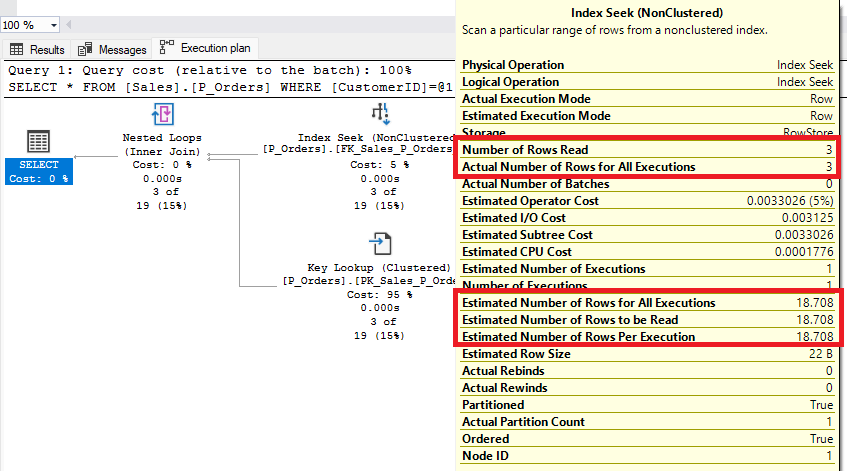
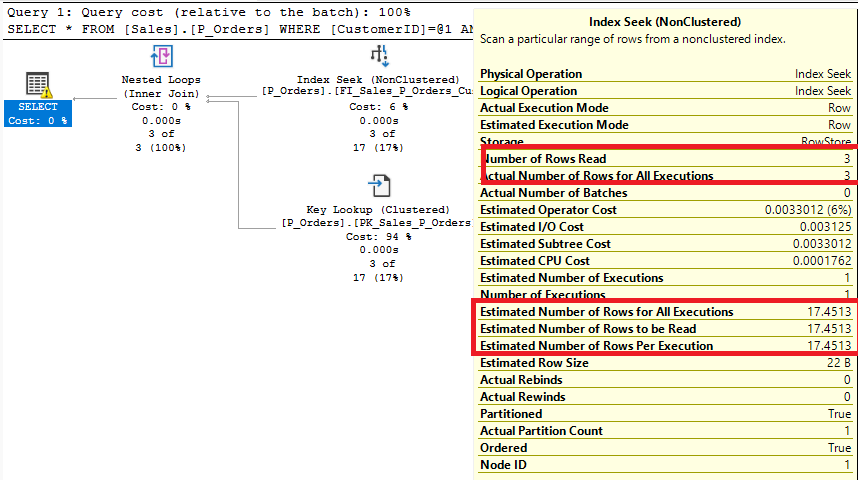

# SQL Server Partitioning and Data Compression

- [SQL Server Partitioning and Data Compression](#sql-server-partitioning-and-data-compression)
	- [1. Setting up the environment](#1-setting-up-the-environment)
	- [2.Table Partitioning](#2table-partitioning)
		- [2.2 Why to partition?](#22-why-to-partition)
		- [2.3 Components](#23-components)
		- [2.4 Aligned Indexes vs Non aligned Indexes](#24-aligned-indexes-vs-non-aligned-indexes)
		- [Demo 1. Creaating a partitioned table](#demo-1-creaating-a-partitioned-table)
		- [2.5 Partitioning and Query Performance](#25-partitioning-and-query-performance)
		- [Demo 2. Partitioning and Query Performance](#demo-2-partitioning-and-query-performance)
		- [2.6 Partitioning and data management](#26-partitioning-and-data-management)
			- [Deleting partitions - Truncate table with partition (SQL Server 2016)](#deleting-partitions---truncate-table-with-partition-sql-server-2016)
			- [Creating partitions - Split Operation](#creating-partitions---split-operation)
		- [Demo 3. Partitioning and Data Management](#demo-3-partitioning-and-data-management)
		- [2.7 Partitioning and index maintenance](#27-partitioning-and-index-maintenance)
		- [Demo 4. Partitioning and Index Maintenance](#demo-4-partitioning-and-index-maintenance)
		- [2.8 Partitioned tables and filtered indexes](#28-partitioned-tables-and-filtered-indexes)
		- [Demo 5. Partitioning and Filtered Indexes](#demo-5-partitioning-and-filtered-indexes)
		- [2.9 Partitioned tables and filtered statistics](#29-partitioned-tables-and-filtered-statistics)
		- [Demo 6. Partitioning and Filtered Statistics](#demo-6-partitioning-and-filtered-statistics)
		- [2.10 Lock Scalation on partitioned tables](#210-lock-scalation-on-partitioned-tables)
		- [Demo 7. Lock Scalation on partitioned tables](#demo-7-lock-scalation-on-partitioned-tables)
	- [3. Data compression](#3-data-compression)
		- [3.1 Compression Levels](#31-compression-levels)
		- [3.2 When to use data compression?](#32-when-to-use-data-compression)
		- [Demo 8. Partitioning and data compression](#demo-8-partitioning-and-data-compression)
	- [4. Table Partitioning and Data Compression in Azure SQL Database](#4-table-partitioning-and-data-compression-in-azure-sql-database)

> **IMPORTANT:** Many images and text are obtained from Microsoft public documention for SQL Server [Partitioned tables and indexes](https://docs.microsoft.com/en-us/sql/relational-databases/partitions/partitioned-tables-and-indexes)

## 1. Setting up the environment

If you want to do the demos by yourself, I recommend you to:

1. Install SQL Server 2019 Developer Edition from [SQL Server Downloads](https://www.microsoft.com/es-mx/sql-server/sql-server-downloads)

1. All demos in this presentation use WideWorldsImporters sample database. You can download WideWorldsImporters at https://github.com/Microsoft/sql-server-samples/tree/master/samples/databases/wide-world-importers

---

## 2.Table Partitioning

Partitioning is available starting in SQL Server 2005

Partitioning is a Enterprise feature of SQL Server from SQL Server 2005 to SQL Server 2016. Starting in SQL Server 2016 SP1, it is available in all editions (including Express and Local DB)

Starting in SQL Server 2012 a table/index can have up to 15000 partitions. In versions earlier than SQL Server 2012, the number of partitions was limited to 1,000 by default.

The data of partitioned tables and indexes is divided into units that can be spread across more than one filegroup in a database. The data is partitioned horizontally, so that groups of rows are mapped into individual partitions


### 2.2 Why to partition?

- The table can be managed at the partition and filegroup level for ease of maintenance.

- Partitioned tables support easier and faster data loading, aging, and archiving.

- Application queries that are properly filtered on the partition column can perform better by making use of partition elimination and parallelism.

- In cases where partitioned data will not be modified, you can mark some or most of a partitioned table's filegroups as read-only, making management of the filegroups easier.

- You can compress individual partitions as well as control lock escalation at a partition level.


### 2.3 Components

- Partition column

  The column of a table or index that a partition function uses to partition the table or index.

- Partition Function 

  Defines the number of partitions the table will have and how the boundaries of the partitions are defined

  A range type (either LEFT or RIGHT), specifies how the boundary values of the partition function will be put into the resulting partitions

  >NOTE: Every row always fit in one the partitions


  - **Range Left** means the boundary value is the last value in the left partition

    ```sql
    CREATE PARTITION FUNCTION PF1_Left (int)
    AS RANGE LEFT FOR VALUES (10,20,30);
	 ``` 

    

	 >If LEFT or RIGHT not specified, LEFT range is the default.

  - **Range Right** means the boundary value is the first value in the right partition

    ```sql
	 CREATE PARTITION FUNCTION PF1_Right (int)
	 AS RANGE RIGHT FOR VALUES (10,20,30);
	 ``` 
 
    

    **Question:** If you decide to partition by a date value, which range type should you use? 

    ```sql
	 CREATE PARTITION FUNCTION PF_byMonth (datetime)
	 AS RANGE ???? FOR VALUES ('2016-01-01','2016-02-01','2016-03-01')
	 ``` 

    Use the image below to make a desision

    

	 **Answer:** XXX 

- Partition Scheme

  Maps the partitions of a partition function to a set of filegroups

  The primary reason for placing your partitions on separate filegroups is to make sure that you can independently perform backup operations on partitions. This is because you can perform backups on individual filegroups. 

  You must create filegroups and datafiles before you create the partition scheme

 

### 2.4 Aligned Indexes vs Non aligned Indexes

- Aligned index

  An index that is built on the same partition scheme as its corresponding table.
  
  When a table and its indexes are in alignment, SQL Server can switch partitions quickly and efficiently while maintaining the partition structure of both the table and its indexes. 

- Nonaligned index:

  An index partitioned independently from its corresponding table. That is, the index has a different partition scheme or is placed on a separate filegroup from the base table. 

  >Creating and rebuilding nonaligned indexes on a table with more than 1,000 partitions is possible, but is not supported. Doing so may cause degraded performance or excessive memory consumption during these operations. We recommend using only aligned indexes when the number of partitions exceed 1,000. 

### Demo 1. Creaating a partitioned table

The table **SalesOrder** will be partiioned considering that:

- A monthly partition will be implemented.

- Filegroups will be reused every three months. 

  �Why? It it just an example. Consider it was the result of previous analysis, this is just one way to define FGs and save as much space as possible when data compression is implemented

- The original table contains data from January 2013 to May 2016

- The following Filegroups have been defined
  - FG_SalesOrder_OldEmpty will originally contain data from negative infinity to December 2013
  - FG_SalesOrder_M_1_5_9 will contain data from January, May and September for all years
  - FG_SalesOrder_M_2_6_10 will contain data from February, June and October for all years
  - FG_SalesOrder_M_3_7_11 will contain data from March, July and November for all years
  - FG_SalesOrder_M_4_8_12 will contain data from April, August and December for all years

- SalesOrder_OldEmpty will not contain any row as it cover from negative infinity to the first partition boundary, so it can be placed in the same disk than any of the other datafiles


1. Create Filegroups to be used by partition schema of Sales.P_Orders

   ```sql
	USE [WideWorldImporters] 
	GO
	ALTER DATABASE [WideWorldImporters] ADD FILEGROUP [FG_SalesOrder_OldEmpty]
	GO
	ALTER DATABASE [WideWorldImporters] ADD FILEGROUP [FG_SalesOrder_M_1_5_9]
	GO
	ALTER DATABASE [WideWorldImporters] ADD FILEGROUP [FG_SalesOrder_M_2_6_10]
	GO
	ALTER DATABASE [WideWorldImporters] ADD FILEGROUP [FG_SalesOrder_M_3_7_11]
	GO
	ALTER DATABASE [WideWorldImporters] ADD FILEGROUP [FG_SalesOrder_M_4_8_12]
	GO
   ```

1. Create at least one datafile on each filegroup used by partition scheme of Sales.P_Orders

	>Make sure to adjust the path for datafiles to one that exists on your demo machine

	```sql
	ALTER DATABASE [WideWorldImporters] 
	ADD FILE ( NAME = N'SalesOrder_OldEmpty', 
	  				FILENAME = N'C:\data\SalesOrder_OldEmpty.ndf' , 
					SIZE = 4096KB , 
					FILEGROWTH = 1024KB ) 
	TO FILEGROUP [FG_SalesOrder_OldEmpty]
	GO

	ALTER DATABASE [WideWorldImporters] 
	ADD FILE ( NAME = N'SalesOrder_M_1_5_9', 
	 				FILENAME = N'C:\data\SalesOrder_M_1_5_9.ndf' , 
					SIZE = 64MB , 
					FILEGROWTH = 128MB ) 
	TO FILEGROUP [FG_SalesOrder_M_1_5_9]
	GO

	ALTER DATABASE [WideWorldImporters] 
	ADD FILE ( NAME = N'SalesOrder_M_2_6_10', 
					FILENAME = N'C:\data\SalesOrder_M_2_6_10.ndf' , 
					SIZE = 64MB , 
					FILEGROWTH = 128MB ) 
	TO FILEGROUP [FG_SalesOrder_M_2_6_10]
	GO

	ALTER DATABASE [WideWorldImporters] 
	ADD FILE ( NAME = N'SalesOrder_M_3_7_11', 
					FILENAME = N'C:\data\SalesOrder_M_3_7_11.ndf' , 
					SIZE = 64MB , 
					FILEGROWTH = 128MB ) 
	TO FILEGROUP [FG_SalesOrder_M_3_7_11]
	GO

	ALTER DATABASE [WideWorldImporters] 
	ADD FILE ( NAME = N'SalesOrder_M_4_8_12', 
				FILENAME = N'C:\data\SalesOrder_M_4_8_12.ndf' , 
				SIZE = 64MB , 
				FILEGROWTH = 128MB ) 
	TO FILEGROUP [FG_SalesOrder_M_4_8_12]
	GO
	```

1. Get the minimum and maximum value in the unpartitioined table for the partition colum 

   ```sql
	SELECT min(OrderDate) as min_orderdate
		 , max(OrderDate) as max_orderdate
	FROM [Sales].[Orders]
	```

	

	This information is required to indentify the first and last range value for the Parition Funtion

1. Calculate the number of rows per month in the unpartitioned table to identify partition boundaries

   ```sql
	USE [WideWorldImporters]
	GO
 
	SELECT year(OrderDate) as year, month(OrderDate) as month, count(*)  
	FROM [Sales].[Orders]
	GROUP BY year(OrderDate), month(OrderDate)
	ORDER BY year(OrderDate), month(OrderDate)
	GO
	```

1. Create the partition function for Sales.Orders just for existing months

   ```sql
	CREATE PARTITION FUNCTION [PF_SalesOrder_MONTHLY](date) 
	AS RANGE RIGHT 
	FOR VALUES ( N'2013-01-01'
				,N'2013-02-01'
				,N'2013-03-01'
				,N'2013-04-01'
				,N'2013-05-01'
				,N'2013-06-01'
				,N'2013-07-01'
				,N'2013-08-01'
				,N'2013-09-01'
				,N'2013-10-01'
				,N'2013-11-01'
				,N'2013-12-01'
				,N'2014-01-01'
				,N'2014-02-01'
				,N'2014-03-01'
				,N'2014-04-01'
				,N'2014-05-01'
				,N'2014-06-01'
				,N'2014-07-01'
				,N'2014-08-01'
				,N'2014-09-01'
				,N'2014-10-01'
				,N'2014-11-01'
				,N'2014-12-01'
				,N'2015-01-01'
				,N'2015-02-01'
				,N'2015-03-01'
				,N'2015-04-01'
				,N'2015-05-01'
				,N'2015-06-01'
				,N'2015-07-01'
				,N'2015-08-01'
				,N'2015-09-01'
				,N'2015-10-01'
				,N'2015-11-01'
				,N'2015-12-01'
				,N'2016-01-01'
				,N'2016-02-01'
				,N'2016-03-01'
				,N'2016-04-01'
				,N'2016-05-01'
			  )
	GO
	```

1. Create partition schema for Sales.Orders

   ```sql
	CREATE PARTITION SCHEME [PS_SalesOrder_MONTHLY] 
	AS PARTITION [PF_SalesOrder_MONTHLY] 
	TO ([FG_SalesOrder_OldEmpty]

	  , [FG_SalesOrder_M_1_5_9] -- Jan 2013
	  , [FG_SalesOrder_M_2_6_10]  
	  , [FG_SalesOrder_M_3_7_11]
	  , [FG_SalesOrder_M_4_8_12]  
	  , [FG_SalesOrder_M_1_5_9]
	  , [FG_SalesOrder_M_2_6_10]  
	  , [FG_SalesOrder_M_3_7_11]
	  , [FG_SalesOrder_M_4_8_12]  
	  , [FG_SalesOrder_M_1_5_9]
	  , [FG_SalesOrder_M_2_6_10]  
	  , [FG_SalesOrder_M_3_7_11]
	  , [FG_SalesOrder_M_4_8_12] -- Dic 2013

	  , [FG_SalesOrder_M_1_5_9] -- Jan 2014
	  , [FG_SalesOrder_M_2_6_10]  
	  , [FG_SalesOrder_M_3_7_11]
	  , [FG_SalesOrder_M_4_8_12]  
	  , [FG_SalesOrder_M_1_5_9]
	  , [FG_SalesOrder_M_2_6_10]  
	  , [FG_SalesOrder_M_3_7_11]
	  , [FG_SalesOrder_M_4_8_12]  
	  , [FG_SalesOrder_M_1_5_9]
	  , [FG_SalesOrder_M_2_6_10]  
	  , [FG_SalesOrder_M_3_7_11]
	  , [FG_SalesOrder_M_4_8_12] -- Dic 2014
  
	  , [FG_SalesOrder_M_1_5_9] -- Jan 2015
	  , [FG_SalesOrder_M_2_6_10]  
	  , [FG_SalesOrder_M_3_7_11]
	  , [FG_SalesOrder_M_4_8_12]  
	  , [FG_SalesOrder_M_1_5_9]
	  , [FG_SalesOrder_M_2_6_10]  
	  , [FG_SalesOrder_M_3_7_11]
	  , [FG_SalesOrder_M_4_8_12]  
	  , [FG_SalesOrder_M_1_5_9]
	  , [FG_SalesOrder_M_2_6_10]  
	  , [FG_SalesOrder_M_3_7_11]
	  , [FG_SalesOrder_M_4_8_12] -- Dic 2015
  
	  , [FG_SalesOrder_M_1_5_9] -- Jan 2016
	  , [FG_SalesOrder_M_2_6_10]  
	  , [FG_SalesOrder_M_3_7_11]
	  , [FG_SalesOrder_M_4_8_12]  
	  , [FG_SalesOrder_M_1_5_9] -- May 2016
	)  
	GO
	```

1. Create the partitioned table on Partition Schema **PS_SalesOrder_MONTHLY** using **OrderDate** as the Partition Column

	```sql
	CREATE TABLE [Sales].[P_Orders](
		[OrderID] [int] NOT NULL,
		[CustomerID] [int] NOT NULL,
		[SalespersonPersonID] [int] NOT NULL,
		[PickedByPersonID] [int] NULL,
		[ContactPersonID] [int] NOT NULL,
		[BackorderOrderID] [int] NULL,
		[OrderDate] [date] NOT NULL,
		[ExpectedDeliveryDate] [date] NOT NULL,
		[CustomerPurchaseOrderNumber] [nvarchar](20) NULL,
		[IsUndersupplyBackordered] [bit] NOT NULL,
		[Comments] [nvarchar](max) NULL,
		[DeliveryInstructions] [nvarchar](max) NULL,
		[InternalComments] [nvarchar](max) NULL,
		[PickingCompletedWhen] [datetime2](7) NULL,
		[LastEditedBy] [int] NOT NULL,
		[LastEditedWhen] [datetime2](7) NOT NULL,
		[rowguid] [uniqueidentifier] ROWGUIDCOL  NOT NULL -- this column does not exists in the original table. It is created for demonstration purposes
		CONSTRAINT [PK_Sales_P_Orders] PRIMARY KEY CLUSTERED 
	   (	[OrderID] ASC  )
	   ON [PS_SalesOrder_MONTHLY](OrderDate)
 	   )
	GO
	```

	

   >You get an error. Why?
  
	Consider that this table has a self reference (FK_Sales_Orders_BackorderOrderID_Sales_Orders)
   - What is the impact of this limitation?
   - What can I do to force uniqueness of OrderID?

	Create the table adding the Partition Column in the Primary Key (UNIQUE Index)

	```sql	
	CREATE TABLE [Sales].[P_Orders](
		[OrderID] [int] NOT NULL,
		[CustomerID] [int] NOT NULL,
		[SalespersonPersonID] [int] NOT NULL,
		[PickedByPersonID] [int] NULL,
		[ContactPersonID] [int] NOT NULL,
		[BackorderOrderID] [int] NULL,
		[BackorderOrderDate] [date] NULL, -- This new column is necessary because the PK must be changed to include OrderDate
		[OrderDate] [date] NOT NULL,
		[ExpectedDeliveryDate] [date] NOT NULL,
		[CustomerPurchaseOrderNumber] [nvarchar](20) NULL,
		[IsUndersupplyBackordered] [bit] NOT NULL,
		[Comments] [nvarchar](max) NULL,
		[DeliveryInstructions] [nvarchar](max) NULL,
		[InternalComments] [nvarchar](max) NULL,
		[PickingCompletedWhen] [datetime2](7) NULL,
		[LastEditedBy] [int] NOT NULL,
		[LastEditedWhen] [datetime2](7) NOT NULL,
		[rowguid] [uniqueidentifier] ROWGUIDCOL  NOT NULL -- this column does not exists in the original table. It is create for demostration pourposes
	CONSTRAINT [PK_Sales_P_Orders] PRIMARY KEY CLUSTERED 
	(	[OrderID] ASC,
		[OrderDate]
	)
	ON [PS_SalesOrder_MONTHLY](OrderDate)
	)
	```

	Create other constraints CHECK, DEFAULT and FKs exisinting in unpartitioned table

	```sql
	-- IMPORTANT: This FK changes its definition because the PK changed, and it is a self-reference

	ALTER TABLE [Sales].[P_Orders]  WITH CHECK ADD  CONSTRAINT [FK_Sales_P_Orders_BackorderOrderID_Sales_P_Orders] FOREIGN KEY([BackorderOrderID],[BackorderOrderDate])
	REFERENCES [Sales].[P_Orders] ([OrderID],[OrderDate])
	GO
	ALTER TABLE [Sales].[P_Orders] CHECK CONSTRAINT [FK_Sales_P_Orders_BackorderOrderID_Sales_P_Orders]
	GO

	-- No other modification is necessary on constraints

	ALTER TABLE [Sales].[P_Orders] ADD  CONSTRAINT [DF_Sales_P_Orders_OrderID]  DEFAULT (NEXT VALUE FOR [Sequences].[OrderID]) FOR [OrderID]
	GO

	ALTER TABLE [Sales].[P_Orders] ADD  CONSTRAINT [DF_Sales_P_Orders_LastEditedWhen]  DEFAULT (sysdatetime()) FOR [LastEditedWhen]
	GO

	ALTER TABLE [Sales].[P_Orders]  WITH CHECK ADD  CONSTRAINT [FK_Sales_P_Orders_Application_People] FOREIGN KEY([LastEditedBy])
	REFERENCES [Application].[People] ([PersonID])
	GO
	ALTER TABLE [Sales].[P_Orders] CHECK CONSTRAINT [FK_Sales_P_Orders_Application_People]
	GO

	ALTER TABLE [Sales].[P_Orders]  WITH CHECK ADD  CONSTRAINT [FK_Sales_P_Orders_ContactPersonID_Application_People] FOREIGN KEY([ContactPersonID])
	REFERENCES [Application].[People] ([PersonID])
	GO
	ALTER TABLE [Sales].[P_Orders] CHECK CONSTRAINT [FK_Sales_P_Orders_ContactPersonID_Application_People]
	GO

	ALTER TABLE [Sales].[P_Orders]  WITH CHECK ADD  CONSTRAINT [FK_Sales_P_Orders_CustomerID_Sales_Customers] FOREIGN KEY([CustomerID])
	REFERENCES [Sales].[Customers] ([CustomerID])
	GO
	ALTER TABLE [Sales].[P_Orders] CHECK CONSTRAINT [FK_Sales_P_Orders_CustomerID_Sales_Customers]
	GO

	ALTER TABLE [Sales].[P_Orders]  WITH CHECK ADD  CONSTRAINT [FK_Sales_P_Orders_PickedByPersonID_Application_People] FOREIGN KEY([PickedByPersonID])
	REFERENCES [Application].[People] ([PersonID])
	GO
	ALTER TABLE [Sales].[P_Orders] CHECK CONSTRAINT [FK_Sales_P_Orders_PickedByPersonID_Application_People]
	GO

	ALTER TABLE [Sales].[P_Orders]  WITH CHECK ADD  CONSTRAINT [FK_Sales_P_Orders_SalespersonPersonID_Application_People] FOREIGN KEY([SalespersonPersonID])
	REFERENCES [Application].[People] ([PersonID])
	GO
	ALTER TABLE [Sales].[P_Orders] CHECK CONSTRAINT [FK_Sales_P_Orders_SalespersonPersonID_Application_People]
	GO
	```

	To see details about the partitions on the table execute:

	```sql
	SELECT
		OBJECT_NAME(p.object_id) AS ObjectName, 
		i.name AS IndexName, 
		p.index_id AS IndexID, 
		ds.name AS PartitionScheme, 
		p.partition_number AS PartitionNumber, 
		p.data_compression_desc as compression_level,
		fg.name AS FileGroupName, 
		prv_left.value AS LowerBoundaryValue, 
		prv_right.value AS UpperBoundaryValue, 
		CASE pf.boundary_value_on_right WHEN 1 THEN 'RIGHT' ELSE 'LEFT' END AS PartitionFunctionRange, 
		p.rows AS Rows
	FROM
		sys.partitions AS p INNER JOIN
		sys.indexes AS i ON i.object_id = p.object_id AND i.index_id = p.index_id INNER JOIN
		sys.data_spaces AS ds ON ds.data_space_id = i.data_space_id INNER JOIN
		sys.partition_schemes AS ps ON ps.data_space_id = ds.data_space_id INNER JOIN
		sys.partition_functions AS pf ON pf.function_id = ps.function_id INNER JOIN
		sys.destination_data_spaces AS dds2 ON dds2.partition_scheme_id = ps.data_space_id AND dds2.destination_id = p.partition_number INNER JOIN
		sys.filegroups AS fg ON fg.data_space_id = dds2.data_space_id LEFT OUTER JOIN
		sys.partition_range_values AS prv_left ON ps.function_id = prv_left.function_id AND prv_left.boundary_id = p.partition_number - 1 LEFT OUTER JOIN
		sys.partition_range_values AS prv_right ON ps.function_id = prv_right.function_id AND prv_right.boundary_id = p.partition_number
	WHERE
    	p.OBJECT_id in ( OBJECT_id ('[Sales].[P_Orders]') )
    	AND 
		p.index_id = 1
	ORDER BY p.object_id, p.index_id, p.partition_number
	```

	Create aligned indexes by executing:

	```sql
	CREATE NONCLUSTERED INDEX [FK_Sales_P_Orders_ContactPersonID] ON [Sales].[P_Orders]
	( [ContactPersonID] ASC )
	ON [PS_SalesOrder_MONTHLY](OrderDate)

	CREATE NONCLUSTERED INDEX [FK_Sales_P_Orders_CustomerID] ON [Sales].[P_Orders]
	( [CustomerID] ASC )
	ON [PS_SalesOrder_MONTHLY](OrderDate)

	CREATE NONCLUSTERED INDEX [FK_Sales_P_Orders_PickedByPersonID] ON [Sales].[P_Orders]
	( [PickedByPersonID] ASC )
	ON [PS_SalesOrder_MONTHLY](OrderDate)

	CREATE NONCLUSTERED INDEX [FK_Sales_P_Orders_SalespersonPersonID] ON [Sales].[P_Orders]
	( [SalespersonPersonID] ASC )
	ON [PS_SalesOrder_MONTHLY](OrderDate)
	```

   To see details about the partitions on the table and indexes execute:

	```sql
	SELECT
		OBJECT_NAME(p.object_id) AS ObjectName, 
		i.name AS IndexName, 
		p.index_id AS IndexID, 
		ds.name AS PartitionScheme, 
		p.partition_number AS PartitionNumber, 
		p.data_compression_desc as compression_level,
		fg.name AS FileGroupName, 
		prv_left.value AS LowerBoundaryValue, 
		prv_right.value AS UpperBoundaryValue, 
		CASE pf.boundary_value_on_right WHEN 1 THEN 'RIGHT' ELSE 'LEFT' END AS PartitionFunctionRange, 
		p.rows AS Rows
	FROM
		sys.partitions AS p INNER JOIN
		sys.indexes AS i ON i.object_id = p.object_id AND i.index_id = p.index_id INNER JOIN
		sys.data_spaces AS ds ON ds.data_space_id = i.data_space_id INNER JOIN
		sys.partition_schemes AS ps ON ps.data_space_id = ds.data_space_id INNER JOIN
		sys.partition_functions AS pf ON pf.function_id = ps.function_id INNER JOIN
		sys.destination_data_spaces AS dds2 ON dds2.partition_scheme_id = ps.data_space_id AND dds2.destination_id = p.partition_number INNER JOIN
		sys.filegroups AS fg ON fg.data_space_id = dds2.data_space_id LEFT OUTER JOIN
		sys.partition_range_values AS prv_left ON ps.function_id = prv_left.function_id AND prv_left.boundary_id = p.partition_number - 1 LEFT OUTER JOIN
		sys.partition_range_values AS prv_right ON ps.function_id = prv_right.function_id AND prv_right.boundary_id = p.partition_number
	WHERE
    	p.OBJECT_id in ( OBJECT_id ('[Sales].[P_Orders]') )
	ORDER BY p.object_id, p.partition_number, i.index_id
	```

	The following index does not exists in the original table but is created to show a concept

	```sql
	CREATE UNIQUE NONCLUSTERED INDEX [AK_Sales_P_Order_rowguid] ON [Sales].[P_Orders]
	( [rowguid] ASC )
	ON [PS_SalesOrder_MONTHLY](OrderDate)
	GO
	```

	>You get an error beacuse the partition columns for a unique index must be a subset of the index key. Similar issue when creating the Primary Key without the partition column

	- What problems in data integrity can this create?
   - Does it make sense to create this UNIQUE index?
   - What can I do to force data uniqueness?

	```sql
	CREATE UNIQUE NONCLUSTERED INDEX [AK_Sales_P_Order_rowguid] ON [Sales].[P_Orders]
	(
		[rowguid] ASC,
		[OrderDate]
	)
	ON [PS_SalesOrder_MONTHLY](OrderDate)
	GO
	```

1. How to tell in which partition a row will fall

   Let's take a snigle row from the original non partitioned table

	```sql
	USE [WideWorldImporters]
	GO
	SELECT TOP 1 * 
	FROM sales.Orders
	WHERE OrderDate = '2013-04-02'
	```

	In which partition will the following row be inserted on Sales.P_Orders?

	You can use the $partition.<partition funtion name> funtion using the date you want to check as parameter

	```sql
	select top 1 $partition.[PF_SalesOrder_MONTHLY](OrderDate) as partition, * 
	from sales.Orders
	where OrderDate = '2013-04-02'
	```

	The result is the partition that correspond to the value

	

	You can see that a row for a different month falls in another partition 

	```sql
	SELECT TOP 1 $partition.[PF_SalesOrder_MONTHLY](OrderDate) as partition, * 
	FROM sales.Orders
	WHERE OrderDate = '2014-11-07'
	```

	

1. Load data from the original table Sales.Orders

   NOTE: The SELECT statement is not as simple as SELECT * FROM TABLE because you there is a self-reference and the PK changed

  	```sql
	INSERT INTO [Sales].[P_Orders]
				  ([OrderID]
				  ,[CustomerID]
				  ,[SalespersonPersonID]
				  ,[PickedByPersonID]
				  ,[ContactPersonID]
				  ,[BackorderOrderID]
				  ,[BackorderOrderDate]
				  ,[OrderDate]
				  ,[ExpectedDeliveryDate]
				  ,[CustomerPurchaseOrderNumber]
				  ,[IsUndersupplyBackordered]
				  ,[Comments]
				  ,[DeliveryInstructions]
				  ,[InternalComments]
				  ,[PickingCompletedWhen]
				  ,[LastEditedBy]
				  ,[LastEditedWhen]
				  ,[rowguid])
	SELECT O.[OrderID]
			,O.[CustomerID]
			,O.[SalespersonPersonID]
			,O.[PickedByPersonID]
			,O.[ContactPersonID]
			,O.[BackorderOrderID]
			,BO.[OrderDate]
			,O.[OrderDate]
			,O.[ExpectedDeliveryDate]
			,O.[CustomerPurchaseOrderNumber]
			,O.[IsUndersupplyBackordered]
			,O.[Comments]
			,O.[DeliveryInstructions]
			,O.[InternalComments]
			,O.[PickingCompletedWhen]
			,O.[LastEditedBy]
			,O.[LastEditedWhen]
		  ,NEWID()
	  FROM [Sales].[Orders] O
	  LEFT JOIN [Sales].[Orders] BO
		ON O.BackorderOrderID = BO.OrderID
	  Order by O.OrderId desc
	GO
	```

	To see details about the partitions on the table execute 

	```sql
	SELECT
		OBJECT_NAME(p.object_id) AS ObjectName, 
		i.name AS IndexName, 
		p.index_id AS IndexID, 
		ds.name AS PartitionScheme, 
		p.partition_number AS PartitionNumber, 
		p.data_compression_desc as compression_level,
		fg.name AS FileGroupName, 
		prv_left.value AS LowerBoundaryValue, 
		prv_right.value AS UpperBoundaryValue, 
		CASE pf.boundary_value_on_right WHEN 1 THEN 'RIGHT' ELSE 'LEFT' END AS PartitionFunctionRange, 
		p.rows AS Rows
	FROM
		sys.partitions AS p INNER JOIN
		sys.indexes AS i ON i.object_id = p.object_id AND i.index_id = p.index_id INNER JOIN
		sys.data_spaces AS ds ON ds.data_space_id = i.data_space_id INNER JOIN
		sys.partition_schemes AS ps ON ps.data_space_id = ds.data_space_id INNER JOIN
		sys.partition_functions AS pf ON pf.function_id = ps.function_id INNER JOIN
		sys.destination_data_spaces AS dds2 ON dds2.partition_scheme_id = ps.data_space_id AND dds2.destination_id = p.partition_number INNER JOIN
		sys.filegroups AS fg ON fg.data_space_id = dds2.data_space_id LEFT OUTER JOIN
		sys.partition_range_values AS prv_left ON ps.function_id = prv_left.function_id AND prv_left.boundary_id = p.partition_number - 1 LEFT OUTER JOIN
		sys.partition_range_values AS prv_right ON ps.function_id = prv_right.function_id AND prv_right.boundary_id = p.partition_number
	WHERE
    	p.OBJECT_id in ( OBJECT_id ('[Sales].[P_Orders]') )
    	AND 
		p.index_id = 1
	ORDER BY p.object_id, p.index_id, p.partition_number
	```

	Check the column "rows" and compare with the number of rows per month in the original table Sales.Orders

	```sql
	SELECT year(OrderDate) as year, month(OrderDate) as month, count(*)  
	FROM [Sales].[Orders]
	GROUP BY year(OrderDate), month(OrderDate)
	ORDER BY year(OrderDate), month(OrderDate)
	GO
	```

	

	Notice that the rows were assigned to the right partition based on the Order Date

### 2.5 Partitioning and Query Performance

Partitioning is widely used due to tis benefits, however keep in mind that:

- The main advantage of partitioning is reducing time required for data maintenance operations: data load, date deletion and index maintenance, and implementing data compression for cold data

- Not all queries benefit from partitioning

- Queries that do not use partition elimination could take longer to execute as the number of partitions increases.

- Queries that use operators such as TOP or MAX/MIN on columns other than the partitioning column may experience reduced performance with partitioning because all partitions must be evaluated.

- With a larger number of partitions, DBCC commands could take longer to execute as the number of partitions increases.

### Demo 2. Partitioning and Query Performance

Compare changes on the execution plan and logical reads when querying partitioned tables and non-partitioned tables

>Make sure you enable Include Actual Execution Plan (Ctrl-M)

1. Search in both tables by the partition column for Sales.P_Orders

	Query the unpartitioned table

	```sql
	USE [WideWorldImporters]
	GO

	set statistics io on

	SELECT * FROM [Sales].[Orders]
	WHERE OrderDate = '2013-07-04'
	```

	Notice the query did 692 logical reads

	

	the execution plan shows a Clustered Index Scan that read 73595 rows and the operator cost was 0.593125
	

	Query the partitioned table

	```sql
	USE [WideWorldImporters]
	GO

	set statistics io on

	SELECT * FROM [Sales].[P_Orders]
	WHERE OrderDate = '2013-07-04'
	```

	Now, to get the result, only 25 pages are read. Big improvement.

	

	The execution plan also shows a Clustered Index Scan so how it is posible to get the same result with the same execution plan and at the same time to do less page reads
	
	Checking the details, the Clustered Index Scan that did only 1886 logical reads and the operator cost was 0.0215314, meaning this query is more efficient. Notice that the execution plan shows it was necessary to access one of the partition (so the Clustered Index Scan was don on only one partition and not the entire table)
	
	
	   
1. Search in both tables by an indexed column other that the partition column for Sales.P_Orders

	Query the unpartitioned table

	```sql
	USE [WideWorldImporters]
	GO

	set statistics io on

	SELECT * FROM  [Sales].[Orders]
	WHERE OrderId = 73548

	SELECT * FROM  [Sales].[P_Orders]
	WHERE OrderId = 73548
	```

	

	Notice the query on the unpartitioned table does less logical reads than the same query on the partitioned table

	You read mores pages using the partitioned table even when both queries use a Clustered Index Seek. The reason is that SQL Server has to check all partitions of the table and the combined size of the internal strcutures for all partitions is bigger than the internal structure for the unpartition table

1. Add the partition column in the WHERE clause to the previous query

	```sql
	USE [WideWorldImporters]
	GO

	set statistics io on

	SELECT * FROM  [Sales].[Orders]
	WHERE OrderId = 73548
	AND OrderDate = '2016-05-31'

	SELECT * FROM  [Sales].[P_Orders]
	WHERE OrderId = 73548
	AND OrderDate = '2016-05-31'
	```

	

	Notice the query on the partitioned table does less logical reads than the same query on the unpartitioned table, as now SQL Serer was able to search for the ros by examining only the partitions that contained becuase the partition column is used in the WHERE clause in a way that partition elimination is possible

1. See the behavior of the TOP, MIN y MAX functions

	```sql
	-- top

	set statistics io on

	SELECT TOP 1 * from [Sales].[Orders]
	WHERE OrderId = 73548
	ORDER BY OrderId

	SELECT TOP 1  * from [Sales].[P_Orders]
	WHERE OrderId = 73548
	ORDER BY OrderId
   ```

	

	The query reads more pages using the partitioned table even when both queries look using the first column of the clustered index. The reason is that SQL Server has to check all partitions of the table and the combined size of the internal strcutures for all partitions is bigger than the internal structure for the unpartition table. 

	You will see the same situation when using MAX and MIN

	```sql
	-- MAX
	set statistics io on

	SELECT max(OrderId) FROM [Sales].[Orders]

	SELECT max(OrderId) FROM [Sales].[P_Orders]
	```

	

	```sql
	-- MIN
	select min(OrderId) from [Sales].[Orders]

	select min(OrderId) from [Sales].[P_Orders]
	```

	


### 2.6 Partitioning and data management

#### Deleting partitions - Truncate table with partition (SQL Server 2016)


```sql
TRUNCATE TABLE dbo.PartitionedTable
WITH (PARTITIONS (1));
```


```sql
ALTER PARTITION FUNCTION PF2_LEFT()
MERGE RANGE (10);
```


#### Creating partitions - Split Operation


```sql
ALTER PARTITION SCHEME PS2_LEFT NEXT USED Filegroup5;

ALTER PARTITION FUNCTION PF2_LEFT() SPLIT RANGE (40);
```


### Demo 3. Partitioning and Data Management

Partitioning management has 3 basic tasks: create partitiona and delete partitions

You can add new partiion to a table until the 15.000 partiions limits. You can also keep just a fixed number of partition in a slideing windows scenarios where you delete the oldest partition and craete a new none for the most recetn data

For this demo, the partiion with the oldest data will be deleted and a new one will bre created for the most recent data

1. What is the partition with the oldest data?

	In this demo, it should always be partition 2. Partition 1 if for the range minus infinity to the first date of data

	Confirm that by executing:

	```sql
	USE [WideWorldImporters]
	GO

	SELECT
		OBJECT_NAME(p.object_id) AS ObjectName, 
		i.name AS IndexName, 
		p.index_id AS IndexID, 
		ds.name AS PartitionScheme, 
		p.partition_number AS PartitionNumber, 
		p.data_compression_desc as compression_level,
		fg.name AS FileGroupName, 
		prv_left.value AS LowerBoundaryValue, 
		prv_right.value AS UpperBoundaryValue, 
		CASE pf.boundary_value_on_right WHEN 1 THEN 'RIGHT' ELSE 'LEFT' END AS PartitionFunctionRange, 
		p.rows AS Rows
	FROM
		sys.partitions AS p INNER JOIN
		sys.indexes AS i ON i.object_id = p.object_id AND i.index_id = p.index_id INNER JOIN
		sys.data_spaces AS ds ON ds.data_space_id = i.data_space_id INNER JOIN
		sys.partition_schemes AS ps ON ps.data_space_id = ds.data_space_id INNER JOIN
		sys.partition_functions AS pf ON pf.function_id = ps.function_id INNER JOIN
		sys.destination_data_spaces AS dds2 ON dds2.partition_scheme_id = ps.data_space_id AND dds2.destination_id = p.partition_number INNER JOIN
		sys.filegroups AS fg ON fg.data_space_id = dds2.data_space_id LEFT OUTER JOIN
		sys.partition_range_values AS prv_left ON ps.function_id = prv_left.function_id AND prv_left.boundary_id = p.partition_number - 1 LEFT OUTER JOIN
		sys.partition_range_values AS prv_right ON ps.function_id = prv_right.function_id AND prv_right.boundary_id = p.partition_number
	WHERE
	p.OBJECT_id in ( OBJECT_id ('[Sales].[P_Orders]') )
	AND p.index_id = 1
	order by p.object_id, p.partition_number, i.index_id
	```

	
	
	See partitionNumber 1 and 2 for the partitioned table

1. Delete old data

	To delete data from a partition, starting SQL Server 2016, you can truncate a partition:

	```sql
	TRUNCATE TABLE [Sales].[P_Orders]
	WITH (PARTITIONS (2));
	```

	Now P_Orders has 2 empty partitions (PartitionNumber=1 and ParitionNumber=2). Confirm that by executing:

	```sql
	SELECT
		OBJECT_NAME(p.object_id) AS ObjectName, 
		i.name AS IndexName, 
		p.index_id AS IndexID, 
		ds.name AS PartitionScheme, 
		p.partition_number AS PartitionNumber, 
		p.data_compression_desc as compression_level,
		fg.name AS FileGroupName, 
		prv_left.value AS LowerBoundaryValue, 
		prv_right.value AS UpperBoundaryValue, 
		CASE pf.boundary_value_on_right WHEN 1 THEN 'RIGHT' ELSE 'LEFT' END AS PartitionFunctionRange, 
		p.rows AS Rows
	FROM
		sys.partitions AS p INNER JOIN
		sys.indexes AS i ON i.object_id = p.object_id AND i.index_id = p.index_id INNER JOIN
		sys.data_spaces AS ds ON ds.data_space_id = i.data_space_id INNER JOIN
		sys.partition_schemes AS ps ON ps.data_space_id = ds.data_space_id INNER JOIN
		sys.partition_functions AS pf ON pf.function_id = ps.function_id INNER JOIN
		sys.destination_data_spaces AS dds2 ON dds2.partition_scheme_id = ps.data_space_id AND dds2.destination_id = p.partition_number INNER JOIN
		sys.filegroups AS fg ON fg.data_space_id = dds2.data_space_id LEFT OUTER JOIN
		sys.partition_range_values AS prv_left ON ps.function_id = prv_left.function_id AND prv_left.boundary_id = p.partition_number - 1 LEFT OUTER JOIN
		sys.partition_range_values AS prv_right ON ps.function_id = prv_right.function_id AND prv_right.boundary_id = p.partition_number
	WHERE
	p.OBJECT_id in ( OBJECT_id ('[Sales].[P_Orders]') )
	AND p.index_id = 1
	order by p.object_id, p.partition_number, i.index_id
	```

	

	Notice:
	- the boundaries between partitionNumber 1 and 2
	- that before the MERGE the table has 41 partitions 

	Drop the partition that was truncated by merging at the bounday of the two empty partitions. 

	```sql
	ALTER PARTITION FUNCTION [PF_SalesOrder_MONTHLY]()
	MERGE RANGE ('2013-02-01')
	```

	Validate that the partition was deleted by executing:

	```sql
	SELECT
		OBJECT_NAME(p.object_id) AS ObjectName, 
		i.name AS IndexName, 
		p.index_id AS IndexID, 
		ds.name AS PartitionScheme, 
		p.partition_number AS PartitionNumber, 
		p.data_compression_desc as compression_level,
		fg.name AS FileGroupName, 
		prv_left.value AS LowerBoundaryValue, 
		prv_right.value AS UpperBoundaryValue, 
		CASE pf.boundary_value_on_right WHEN 1 THEN 'RIGHT' ELSE 'LEFT' END AS PartitionFunctionRange, 
		p.rows AS Rows
	FROM
		sys.partitions AS p INNER JOIN
		sys.indexes AS i ON i.object_id = p.object_id AND i.index_id = p.index_id INNER JOIN
		sys.data_spaces AS ds ON ds.data_space_id = i.data_space_id INNER JOIN
		sys.partition_schemes AS ps ON ps.data_space_id = ds.data_space_id INNER JOIN
		sys.partition_functions AS pf ON pf.function_id = ps.function_id INNER JOIN
		sys.destination_data_spaces AS dds2 ON dds2.partition_scheme_id = ps.data_space_id AND dds2.destination_id = p.partition_number INNER JOIN
		sys.filegroups AS fg ON fg.data_space_id = dds2.data_space_id LEFT OUTER JOIN
		sys.partition_range_values AS prv_left ON ps.function_id = prv_left.function_id AND prv_left.boundary_id = p.partition_number - 1 LEFT OUTER JOIN
		sys.partition_range_values AS prv_right ON ps.function_id = prv_right.function_id AND prv_right.boundary_id = p.partition_number
	WHERE
	p.OBJECT_id in ( OBJECT_id ('[Sales].[P_Orders]') )
	AND p.index_id = 1
	order by p.object_id, p.partition_number, i.index_id
	```

	

	Notice:
   - Notice the boundaries between partitionNumber 1 and 2
   - Notice that after the MERGE the table has 40 partitions 

1. Create a partition for the next month

   Create the partition for June 2016
   Set the Filegroup to be used for the new parittion

	```sql
	ALTER PARTITION SCHEME [PS_SalesOrder_MONTHLY] 
	NEXT USED [FG_SalesOrder_M_2_6_10];
	```

	Create the new parition

	```sql
	ALTER PARTITION FUNCTION [PF_SalesOrder_MONTHLY]()
	SPLIT RANGE ('2016-06-01');
	```

	Validate that a the partition was created by executing:
	```sql
	SELECT
		OBJECT_NAME(p.object_id) AS ObjectName, 
		i.name AS IndexName, 
		p.index_id AS IndexID, 
		ds.name AS PartitionScheme, 
		p.partition_number AS PartitionNumber, 
		p.data_compression_desc as compression_level,
		fg.name AS FileGroupName, 
		prv_left.value AS LowerBoundaryValue, 
		prv_right.value AS UpperBoundaryValue, 
		CASE pf.boundary_value_on_right WHEN 1 THEN 'RIGHT' ELSE 'LEFT' END AS PartitionFunctionRange, 
		p.rows AS Rows
	FROM
		sys.partitions AS p INNER JOIN
		sys.indexes AS i ON i.object_id = p.object_id AND i.index_id = p.index_id INNER JOIN
		sys.data_spaces AS ds ON ds.data_space_id = i.data_space_id INNER JOIN
		sys.partition_schemes AS ps ON ps.data_space_id = ds.data_space_id INNER JOIN
		sys.partition_functions AS pf ON pf.function_id = ps.function_id INNER JOIN
		sys.destination_data_spaces AS dds2 ON dds2.partition_scheme_id = ps.data_space_id AND dds2.destination_id = p.partition_number INNER JOIN
		sys.filegroups AS fg ON fg.data_space_id = dds2.data_space_id LEFT OUTER JOIN
		sys.partition_range_values AS prv_left ON ps.function_id = prv_left.function_id AND prv_left.boundary_id = p.partition_number - 1 LEFT OUTER JOIN
		sys.partition_range_values AS prv_right ON ps.function_id = prv_right.function_id AND prv_right.boundary_id = p.partition_number
	WHERE
	p.OBJECT_id in ( OBJECT_id ('[Sales].[P_Orders]') )
	AND p.index_id = 1
	order by p.object_id, p.partition_number, i.index_id
	```

	Notice that:
   - after the SPLIT the table has 41 partitions 
   - the boudnaries for PartitionNumber=41


### 2.7 Partitioning and index maintenance	

You can rebuild or reorganize a partition (or a group of it) instead of the entire table. 

It increases the availability of the database and reduces the performance impact of maintenances

>NOTE: ONLINE option is available starting SQL Sever 2014

```sql
ALTER INDEX IX_TransactionHistory_TransactionDate
ON Production.TransactionHistory
REBUILD Partition = 5 
WITH ( ONLINE = ON )
```

### Demo 4. Partitioning and Index Maintenance

1. Calculate the fragmentation for all partitions of index_id = 1 for [Sales].[P_Orders]

	```sql
	select database_id, object_id, index_id, partition_number, avg_fragmentation_in_percent
	from sys.dm_db_index_physical_stats (db_id(), object_id('[Sales].[P_Orders]'),1,null,'LIMITED' )
	```

1. Calculate the fragmentation for all partitions of all indexes of [Sales].[P_Orders]

	```sql
	select database_id, object_id, index_id, partition_number, avg_fragmentation_in_percent
	from sys.dm_db_index_physical_stats (db_id(), object_id('[Sales].[P_Orders]'),null,null,'LIMITED' )
	```

1. Calculate the fragmentation for partition 10 for index_id=1 of [Sales].[P_Orders]

	```sql
	select database_id, object_id, index_id, partition_number, avg_fragmentation_in_percent
	from sys.dm_db_index_physical_stats (db_id(), object_id('[Sales].[P_Orders]'),1,10,'LIMITED' )
	```

1. Rebuild a single partition of [Sales].[P_Orders]

	```sql
	ALTER INDEX [PK_Sales_P_Orders]
	ON [Sales].[P_Orders]
	REBUILD Partition = 10
	WITH ( ONLINE = ON )  -- ONLINE is a new option in SQL Server 2014
	```

1. Rebuild all partitions of [Sales].[P_Orders]

	```sql
	ALTER INDEX [PK_Sales_P_Orders]
	ON [Sales].[P_Orders]
	REBUILD 
	WITH ( ONLINE = ON )  -- ONLINE is a new option in SQL Server 2014
	```

1. Reorganize a single partition of [Sales].[P_Orders]

	```sql
	ALTER INDEX [PK_Sales_P_Orders]
	ON [Sales].[P_Orders]
	REORGANIZE Partition = 8
	```

1. Reorganize all partitions of [Sales].[P_Orders]

	```sql
	ALTER INDEX [PK_Sales_P_Orders]
	ON [Sales].[P_Orders]
	REORGANIZE 
	```

### 2.8 Partitioned tables and filtered indexes

When you use partitioning to handle historical data, it is usual that you execute queries on the single partition that contains live data and other queries on the partitions that contain historical data.

In this scenario, it makes no sense to create a index on the whole table when you only need it to query data on some partitions. � This is valid even for non partitioned tables

One advantage is that you also save space as the index only contains entries for data you are actually accessing. It is also possible that the statistics for the index are more precise as less data in covered by the statistic. 

Filtered indexes are not used if you query span over more than one partition.

Creation and elimination of filtered indexes should be part of the automated partition maintenance process.

```sql
CREATE NONCLUSTERED INDEX [FI_Sales_P_Orders_CustomerID_2016_05] ON [Sales].[P_Orders]
([CustomerID] ASC)
WHERE OrderDate >= '2016-05-01' and OrderDate < '2016-06-01'
ON [PS_SalesOrder_MONTHLY](OrderDate)
GO
```

### Demo 5. Partitioning and Filtered Indexes

Suppose that your application only allows you to list the orders for a customer for the last sixty days so, it does not make sense to index that all table by customerId

>NOTE: In the demo, a fixed date is used and not getdate() because the table only contains records up to 2016-06-01

>Make sure you enable Include Actual Execution Plan (Ctrl-M)

```sql
USE [WideWorldImporters]
GO

set statistics io on

SELECT * 
FROM [Sales].[P_Orders]
WHERE CustomerID = 404
AND OrderDate >= '2016-04-01' and OrderDate < '2016-05-01'
```



This query uses an Index Seek operator, a reduced number of logical reads and due to partition elimination, it is quite efficient

Look at the Actual Number of Rows and the Estimated Number of Rows, not quite good

See how much space the index uses with the following script

```sql
SELECT i.[name] AS IndexName ,SUM(s.[used_page_count]) * 8 AS IndexSizeKB
FROM sys.dm_db_partition_stats AS s
INNER JOIN sys.indexes AS i ON s.[object_id] = i.[object_id]
    AND s.[index_id] = i.[index_id]
AND i.object_id = object_id('Sales.P_Orders')
WHERE i.name = 'FK_Sales_P_Orders_CustomerID'
GROUP BY i.[name]
GO
```

This index covers all data in the table but we only search rows for the last sixty days so we have "wasted" space onthe index. It is posible to
improve space usage and index efficiency and reduce time for maintenance operations by deleting the original index and create three indexes, each covering each the last three months

>Depending the escenario insted of creating three indexes, you can crete a single index for the last 3 months.. The only way to know the best option is to create them and tests querys and compare execution plans

```sql
DROP INDEX [FK_Sales_P_Orders_CustomerID] ON [Sales].[P_Orders]
GO

CREATE NONCLUSTERED INDEX [FI_Sales_P_Orders_CustomerID_2016_05] ON [Sales].[P_Orders]
(	[CustomerID] ASC	)
WHERE OrderDate >= '2016-05-01' and OrderDate < '2016-06-01'
ON [PS_SalesOrder_MONTHLY](OrderDate)
GO

CREATE NONCLUSTERED INDEX [FI_Sales_P_Orders_CustomerID_2016_04] ON [Sales].[P_Orders]
(	[CustomerID] ASC	)
WHERE OrderDate >= '2016-04-01' and OrderDate < '2016-05-01'
ON [PS_SalesOrder_MONTHLY](OrderDate)
GO

CREATE NONCLUSTERED INDEX [FI_Sales_P_Orders_CustomerID_2016_03] ON [Sales].[P_Orders]
(	[CustomerID] ASC	)
WHERE OrderDate >= '2016-03-01' and OrderDate < '2016-04-01'
ON [PS_SalesOrder_MONTHLY](OrderDate)
GO
```

Run the same query again

```sql
DBCC FREEPROCCACHE

SELECT * 
FROM [Sales].[P_Orders]
WHERE CustomerID = 404
AND OrderDate >= '2016-04-01' and OrderDate < '2016-05-01'
```



Look at the Actual Number of Rows and the Estimated Number of Rows. SQL Server was able to make a better estimation

See how much space the index uses with the following script

```sql
SELECT i.[name] AS IndexName ,SUM(s.[used_page_count]) * 8 AS IndexSizeKB
FROM sys.dm_db_partition_stats AS s
INNER JOIN sys.indexes AS i ON s.[object_id] = i.[object_id]
    AND s.[index_id] = i.[index_id]
AND i.object_id = object_id('Sales.P_Orders')
WHERE i.name like 'FI_Sales_P_Orders_CustomerID%'
GROUP BY i.[name]
GO
```

Now less space is used for indexes, aroud 168KB insted of 2048KB

Do the same search but using variables

```sql
DBCC FREEPROCCACHE

declare @fecha_inicial date = '2016-04-01'
declare @fecha_final date = '2016-05-01'

SELECT * 
FROM [Sales].[P_Orders]
WHERE CustomerID = 404
AND OrderDate >= @fecha_inicial and OrderDate < @fecha_final
```

Notice that the estimation is not that good and the filtered index is not used. why?


Use the option RECOMPILE

```sql
declare @fecha_inicial date = '2016-04-01'
declare @fecha_final date = '2016-05-01'

SELECT * 
FROM [Sales].[P_Orders]
WHERE CustomerID = 404
AND OrderDate >= @fecha_inicial and OrderDate < @fecha_final
OPTION (RECOMPILE)
```

The query uses the filtered index only when you use RECOMPILE, Why?

Expand the range of search

```sql
DBCC FREEPROCCACHE

SELECT * 
FROM [Sales].[P_Orders]
WHERE CustomerID = 404
AND OrderDate >= '2016-04-01' and OrderDate < '2016-06-01'
```

Notice that you do not use filtered indexes and SQL scans the table even when the two indexes (combined) cover the range. Why?

Is there anything you can do to improve performance using filtered indexes in this scenario? Think of maintenance effors

Just to leave the database as it as originally execute the following commands

```sql
CREATE NONCLUSTERED INDEX [FK_Sales_P_Orders_CustomerID] ON [Sales].[P_Orders]
( [CustomerID] ASC )
ON [PS_SalesOrder_MONTHLY](OrderDate)
GO
DROP INDEX [FI_Sales_P_Orders_CustomerID_2016_03] ON [Sales].[P_Orders]
GO
DROP INDEX [FI_Sales_P_Orders_CustomerID_2016_04] ON [Sales].[P_Orders]
GO
DROP INDEX [FI_Sales_P_Orders_CustomerID_2016_05] ON [Sales].[P_Orders]
GO
```

### 2.9 Partitioned tables and filtered statistics

If you have an index on the whole table, it is possible that its statistic is not that precise due to the limitation of 200 steps on the histogram.

You can use filtered statistics to help SQL Server to get better cardinality estimations.

For example, you can create a statistics to cover just the data on an specific partition (and create one statistic per partition if necessary). It is possible that a filtered statistic is not used if you query span over more than one partition, but you can create filtered statistics that do no align with partition boundaries if necessary.

You can update statistics more frequently as it only considers a portion of the data

Filtered statistic could not be necessary if you create a filtered index on a partition.

Creation and elimination of filtered statistics should be part of the automated partition maintenance process

```sql
CREATE STATISTICS [STAT_Sales_P_Order_2016_03] ON [Sales].[P_Orders] 
([CustomerID] )  
WHERE ( OrderDate >= '2016-03-01' and OrderDate < '2016-04-01' )
WITH FULLSCAN
```

### Demo 6. Partitioning and Filtered Statistics

Supose that your application only allows you to list the of orders for a customer for the last sixty days

>NOTE: In the demo, a fixed date is used and not getdate() because the table only contains records up to 2016-06-01

```sql
USE [WideWorldImporters]
go

-- NOTE: Enable the trace flag based on your SQL Server version

--DBCC TRACEON(2363,3604,-1) -- For SQL Server 2014+
--DBCC TRACEON(9204,3604,-1) -- For SQL Server 2012
-- NOTE: We use a fixed date and not getdate() because
--       the table conly contains records up to 2016-06-01

-- Include Actual Execution Plan (Ctrl-M)

set statistics io on

DBCC FREEPROCCACHE

SELECT * 
FROM [Sales].[P_Orders]
WHERE CustomerID = 404
AND OrderDate >= '2016-04-01' and OrderDate < '2016-05-01'
```

This query uses an Index Seek operator, a reduced number of logical reads and due to partition elimination, it is quite efficient

However, look at the Actual Number of Rows and the Estimated Number of Rows

You can check the Message tab to see which histograms were loaded  and use the following query to see existing statitics on the table

```sql
select * from sys.stats
where object_id = object_id ('[Sales].[P_Orders]')
```

To get better estimations, lets create filtered statistics  for the last three months (3 partitions)

```sql
CREATE STATISTICS [STAT_Sales_P_Order_CustomerID_2016_05] ON [Sales].[P_Orders] 
([CustomerID] )  
WHERE ( OrderDate >= '2016-05-01' and OrderDate < '2016-06-01' )
WITH FULLSCAN

CREATE STATISTICS [STAT_Sales_P_Order_CustomerID_2016_04] ON [Sales].[P_Orders] 
([CustomerID] )  
WHERE ( OrderDate >= '2016-04-01' and OrderDate < '2016-05-01' )
WITH FULLSCAN

CREATE STATISTICS [STAT_Sales_P_Order_CustomerID_2016_03] ON [Sales].[P_Orders] 
([CustomerID] )  
WHERE ( OrderDate >= '2016-03-01' and OrderDate < '2016-04-01' )
WITH FULLSCAN
```

Run the query again

```sql
DBCC FREEPROCCACHE

SELECT * 
FROM [Sales].[P_Orders]
WHERE CustomerID = 404
AND OrderDate >= '2016-04-01' and OrderDate < '2016-05-01'
```

Look at the Actual Number of Rows and the Estimated Number of Rows. Can SQL Server make better estimations?

You can check the Message tab to see which histograms were loaded. Notice that the filtered statistic for April 2016 was loaded

```sql
select * from sys.stats
where object_id = object_id ('[Sales].[P_Orders]')
```

Execute the original query but using variables

```sql
DBCC FREEPROCCACHE

declare @fecha_inicial date = '2016-04-01'
declare @fecha_final date = '2016-05-01'

SELECT * 
FROM [Sales].[P_Orders]
WHERE CustomerID = 404
AND OrderDate >= @fecha_inicial and OrderDate < @fecha_final
GO
```

Notice that the estimation is not that good.
You can check the Message tab to see which histograms were loaded. No statistic was loaded (or maybe a system generated statistic). Why?

Use the option RECOMPILE

```sql
DBCC FREEPROCCACHE

declare @fecha_inicial date = '2016-04-01'
declare @fecha_final date = '2016-05-01'

SELECT * 
FROM [Sales].[P_Orders]
WHERE CustomerID = 404
AND OrderDate >= @fecha_inicial and OrderDate < @fecha_final
option (recompile)
```

You get better estimations, Why?

Notice that the filtered statistic for April 2016 was loaded

```sql
select * from sys.stats
where object_id = object_id ('[Sales].[P_Orders]')
```

Expand the range of search

```sql
DBCC FREEPROCCACHE

SELECT * 
FROM [Sales].[P_Orders]
WHERE CustomerID = 404
AND OrderDate >= '2016-04-01' and OrderDate < '2016-06-01'
```

Notice that the estimation is not that good.
You can check the Message tab to see which histograms were loaded, The filtered statistics were not loaded even when the three statistics (combined) cover the range. Why?

To get better estimations, create filtered statistics for the last Quarter

```sql
CREATE STATISTICS [STAT_Sales_P_Order_CustomerId2016_Q2] ON [Sales].[P_Orders] 
([CustomerID] )  
WHERE ( OrderDate >= '2016-04-01' and OrderDate < '2016-07-01' )
WITH FULLSCAN
```

Run the query again

```sql
DBCC FREEPROCCACHE

SELECT * 
FROM [Sales].[P_Orders]
WHERE CustomerID = 404
AND OrderDate >= '2016-04-01' and OrderDate < '2016-06-01'
```

Notice that you have better estimation. Check the message tab and confirm you are now using the filterd statistic for the quarter

```sql
select * from sys.stats
where object_id = object_id ('[Sales].[P_Orders]')
```

### 2.10 Lock Scalation on partitioned tables

The Database Engine does not escalate row or key-range locks to page locks or partition locks, but escalates them directly to table locks


Lock escalation is triggered when lock escalation is not disabled on the table by using the ALTER TABLE SET LOCK_ESCALATION option, and when either of the following conditions exists: 

- A single Transact-SQL statement acquires at least 5,000 locks on a single nonpartitioned table or index.

- A single Transact-SQL statement acquires at least 5,000 locks on a single partition of a partitioned table and the ALTER TABLE SET LOCK_ESCALATION option is set to AUTO.

- The number of locks in an instance of the Database Engine exceeds memory or configuration thresholds.

- Engine must take a table lock to protect data integrity. 

You can change table the lock scalation behavior of a table by using the ALTER TABLE SET LOCK_ESCALATION 

- TABLE: Lock escalation will be done at table-level granularity regardless whether the table is partitioned or not partitioned. TABLE is the default value. 

- AUTO: If the table is partitioned, lock escalation will be allowed to partition. After the lock is escalated to the partition level, the lock will not be escalated later to TABLE granularity. 
If the table is not partitioned, the lock escalation will be done to the TABLE granularity. 

- DISABLE: Prevents lock escalation in most cases. Table-level locks are not completely disallowed. For example, when you are scanning a table that has no clustered index under the serializable isolation level, Database Engine must take a table lock to protect data integrity. 

### Demo 7. Lock Scalation on partitioned tables

See the locks held when doing a Select operation

```sql
Set Transaction Isolation Level Repeatable Read

USE [WideWorldImporters]
go

BEGIN TRANSACTION

	SELECT * FROM  [Sales].[P_Orders]
	WHERE OrderDate = '2016-04-14' 

	Select * from sys.dm_tran_locks 
	where request_session_id = @@SPID 
	order by resource_type
```

- How many locks do you see? 
- Why do you see PAGE KEY, PAGE, OBJECT and DATABASE locks 

```sql
ROLLBACK
```

Read more than 5000 rows

```sql
BEGIN TRANSACTION

	SELECT * FROM  [Sales].[P_Orders]
	WHERE OrderDate > '2016-02-14' 

	Select * from sys.dm_tran_locks 
	where request_session_id = @@SPID 
	order by resource_type
```

Even when there more than 5000 locks, there are not 5000 locks on a single partition, so there is no lock scalation to table

```sql
ROLLBACK
```

For demo purposes, load around 50000 rows on a sigle partition

```sql
DECLARE @rows_in_partition int = 1

SELECT @rows_in_partition = COUNT(*) FROM [Sales].[P_Orders]
WHERE OrderDate>='2015-07-01' AND OrderDate < '2015-08-01'

while  @rows_in_partition < 50000
BEGIN

	INSERT INTO [Sales].[P_Orders]
	SELECT O.[OrderID] + 100000 + @rows_in_partition
      ,O.[CustomerID]
      ,O.[SalespersonPersonID]
      ,O.[PickedByPersonID]
      ,O.[ContactPersonID]
      ,NULL --[BackorderOrderID]
      ,NULL --[BackorderOrderDate]
      ,O.[OrderDate]
      ,O.[ExpectedDeliveryDate]
      ,O.[CustomerPurchaseOrderNumber]
      ,O.[IsUndersupplyBackordered]
      ,O.[Comments]
      ,O.[DeliveryInstructions]
      ,O.[InternalComments]
      ,O.[PickingCompletedWhen]
      ,O.[LastEditedBy]
      ,O.[LastEditedWhen]
	  ,NEWID()
  FROM [Sales].[Orders] O
  WHERE OrderDate>='2015-07-01' AND OrderDate < '2015-08-01'
  Order by OrderID DESC

  SELECT @rows_in_partition = COUNT(*) FROM [Sales].[P_Orders]
  WHERE OrderDate>='2015-07-01' AND OrderDate < '2015-08-01'

END
```
 
Read more than 5000 locks from a single partition

```sql
BEGIN TRANSACTION

select * FROM  [Sales].[P_Orders]
WHERE OrderDate >= '2015-07-03'  and OrderDate < '2015-07-15' 

Select * from sys.dm_tran_locks 
where request_session_id = @@SPID 
order by resource_type

```

Notice that olny have 2 locks now. Lhe lock with resource_type = OBJECT is the lock a the table level

In another session execute the following two sentences

```sql
select * FROM  [Sales].[P_Orders]
WHERE OrderId  = 100

delete FROM  [Sales].[P_Orders]
WHERE OrderId  = 100
```

Notice that the query gets blocked even when the row you are trying to delete is in other partition, Why?		

Stop the query on the second session and close it

```sql
ROLLBACK
```

Change the scalation mode for the table to AUTO

```sql
ALTER TABLE [Sales].[P_Orders]SET (LOCK_ESCALATION = AUTO);  
GO  
```

Execute the same query and see how the behavior changes

```sql
BEGIN TRANSACTION

select * FROM  [Sales].[P_Orders]
WHERE OrderDate >= '2015-07-03'  and OrderDate < '2015-07-15' 

Select * from sys.dm_tran_locks 
where request_session_id = @@SPID 
order by resource_type
```

Notice that now you have 3 locks. The lock with resource_type = HOBT is the lock a the partition level
	

In another session execute the following two sentences

```sql
select * FROM  [Sales].[P_Orders]
WHERE OrderId  = 101

delete FROM  [Sales].[P_Orders]
WHERE OrderId  = 101
```

Notice that the query gets blocked even when the rou you are trying to delete is in other partition, Why?		

Stop the query
	
On the second session, execute the following query to try to delete the record making a small change to the query 

```sql
delete FROM  [Sales].[P_Orders]
WHERE OrderId  = 101
and OrderDate = '2013-01-02'
```

Notice that now you can delete the row, Why?

```sql
ROLLBACK
```

## 3. Data compression

It does not change the table structure so no modification is required on applications. 

You can compress specific partition of an index, so you can compress partitions that only contain cold data. This way you increase reports performance without affecting transactional operation on active partitions.

Two compression level exists on SQL Server 2008 +


### 3.1 Compression Levels

- Row Compression

  The new record storage format has the following main changes:

  It reduces the metadata overhead that is associated with the record. This metadata is information about columns, their lengths and offsets.

  It stores fixed character strings by using variable-length format by not storing the blank characters.


- Page compression

  When you use page compression, non-leaf-level pages of indexes are compressed by using only row compression

  Compressing the leaf level of tables and indexes with page compression consists of three operations in the following order:

  - Row compression
  - Prefix compression
  - Dictionary compression

  


### 3.2 When to use data compression?

Compression uses more CPU and increase response time for inserts and update operations.

Compression reduces response time for read operations as less IO is required.

It is recommended mainly for non changing data or data that changes unfrequently.

Estimate how much data you will save for each index using [sp_estimate_data_compression_savings](https://docs.microsoft.com/en-us/sql/relational-databases/system-stored-procedures/sp-estimate-data-compression-savings-transact-sql)

You must decide which compression mode to use: row or page
- Do not use compression if saving with both modes will be insignificant.
- Use PAGE instead of ROW if saving is significantly higher with PAGE than with ROW.
- If you must compress data that changes constantly use ROW to reduce performance penalty.

### Demo 8. Partitioning and data compression


Estimate the compression savings for the clustered index using both compression levels

```sql
USE [WideWorldImporters]
GO
EXEC sp_estimate_data_compression_savings 'Sales', 'Orders', 1, NULL, 'ROW' ;
GO
EXEC sp_estimate_data_compression_savings 'Sales', 'Orders', 1, NULL, 'PAGE' ;
GO
```

- Which compression level should I use for the clustered index?

See IO generated by each level of compression

- How much IO is generated if the tables is read completly without compression?

	```sql
	SET STATISTICS IO ON
	SELECT * FROM [Sales].[P_Orders]
	```

	You get around 1500 logical reads (if you completed previous demos) 

- How much IO is generated if the tables is read completly using ROW compression?

	```sql
	alter index [PK_Sales_P_Orders] on [Sales].[P_Orders] 
	REBUILD with (data_compression = ROW)

	SELECT * FROM [Sales].[P_Orders]
	```

	You get around 1135 logical reads (if you completed previous demos) 

- How much IO is generated if the tables is read completly using PAGE compression?

	```sql
	alter index [PK_Sales_P_Orders] on [Sales].[P_Orders] 
	REBUILD with (data_compression = PAGE)

	SELECT * FROM [Sales].[P_Orders]
	```

	You get around 839 logical reads (if you completed previous demos) 

To continue with the demo, uncompress the table first by executing:

```sql
alter index [PK_Sales_P_Orders] on [Sales].[P_Orders] 
REBUILD with (data_compression = NONE)
```

You should you the same analysis for each Index and select the best compression level for it

```sql
EXEC sp_estimate_data_compression_savings 'Sales', 'P_Orders', 2, NULL, 'ROW' ;
GO
EXEC sp_estimate_data_compression_savings 'Sales', 'P_Orders', 2, NULL, 'PAGE' ;
GO
```

 Which compression level should I use for the index_id = 2?

Compress some specific partitions of index_id=1

```sql
alter index [PK_Sales_P_Orders]  on [Sales].[P_Orders] 
REBUILD PARTITION=2 with (data_compression = ROW)
go
alter index [PK_Sales_P_Orders] on [Sales].[P_Orders] 
REBUILD PARTITION=3 with (data_compression = PAGE)
go
```

Execute:

```sql
SELECT
	OBJECT_NAME(p.object_id) AS ObjectName, 
	i.name AS IndexName, 
	p.index_id AS IndexID, 
	ds.name AS PartitionScheme, 
	p.partition_number AS PartitionNumber, 
	p.data_compression_desc as compression_level,
	fg.name AS FileGroupName, 
	prv_left.value AS LowerBoundaryValue, 
	prv_right.value AS UpperBoundaryValue, 
	CASE pf.boundary_value_on_right WHEN 1 THEN 'RIGHT' ELSE 'LEFT' END AS PartitionFunctionRange, 
	p.rows AS Rows
FROM
	sys.partitions AS p INNER JOIN
	sys.indexes AS i ON i.object_id = p.object_id AND i.index_id = p.index_id INNER JOIN
	sys.data_spaces AS ds ON ds.data_space_id = i.data_space_id INNER JOIN
	sys.partition_schemes AS ps ON ps.data_space_id = ds.data_space_id INNER JOIN
	sys.partition_functions AS pf ON pf.function_id = ps.function_id INNER JOIN
	sys.destination_data_spaces AS dds2 ON dds2.partition_scheme_id = ps.data_space_id AND dds2.destination_id = p.partition_number INNER JOIN
	sys.filegroups AS fg ON fg.data_space_id = dds2.data_space_id LEFT OUTER JOIN
	sys.partition_range_values AS prv_left ON ps.function_id = prv_left.function_id AND prv_left.boundary_id = p.partition_number - 1 LEFT OUTER JOIN
	sys.partition_range_values AS prv_right ON ps.function_id = prv_right.function_id AND prv_right.boundary_id = p.partition_number
WHERE
p.OBJECT_id in ( OBJECT_id ('[Sales].[P_Orders]') )
AND p.index_id = 1
order by p.object_id, p.index_id, p.partition_number
```

Take a look of compression_level column. Notice that you can have different compression level on different partitoins on the same index

Execute:

```sql
SELECT
	OBJECT_NAME(p.object_id) AS ObjectName, 
	i.name AS IndexName, 
	p.index_id AS IndexID, 
	ds.name AS PartitionScheme, 
	p.partition_number AS PartitionNumber, 
	p.data_compression_desc as compression_level,
	fg.name AS FileGroupName, 
	prv_left.value AS LowerBoundaryValue, 
	prv_right.value AS UpperBoundaryValue, 
	CASE pf.boundary_value_on_right WHEN 1 THEN 'RIGHT' ELSE 'LEFT' END AS PartitionFunctionRange, 
	p.rows AS Rows
FROM
	sys.partitions AS p INNER JOIN
	sys.indexes AS i ON i.object_id = p.object_id AND i.index_id = p.index_id INNER JOIN
	sys.data_spaces AS ds ON ds.data_space_id = i.data_space_id INNER JOIN
	sys.partition_schemes AS ps ON ps.data_space_id = ds.data_space_id INNER JOIN
	sys.partition_functions AS pf ON pf.function_id = ps.function_id INNER JOIN
	sys.destination_data_spaces AS dds2 ON dds2.partition_scheme_id = ps.data_space_id AND dds2.destination_id = p.partition_number INNER JOIN
	sys.filegroups AS fg ON fg.data_space_id = dds2.data_space_id LEFT OUTER JOIN
	sys.partition_range_values AS prv_left ON ps.function_id = prv_left.function_id AND prv_left.boundary_id = p.partition_number - 1 LEFT OUTER JOIN
	sys.partition_range_values AS prv_right ON ps.function_id = prv_right.function_id AND prv_right.boundary_id = p.partition_number
WHERE
p.OBJECT_id in ( OBJECT_id ('[Sales].[P_Orders]') )
AND p.partition_number = 2
order by p.object_id, p.partition_number, i.index_id
```sql

and take a look of compression_level column. Notice that the same partition for different indexes can have different compression level

You can also compress several partitions of index_id=1 at once

```sql
alter index [PK_Sales_P_Orders]  on [Sales].[P_Orders] 
REBUILD PARTITION = ALL with (data_compression = PAGE ON PARTITIONS (2 to 40))
```

Execute 

```sql
SELECT
	OBJECT_NAME(p.object_id) AS ObjectName, 
	i.name AS IndexName, 
	p.index_id AS IndexID, 
	ds.name AS PartitionScheme, 
	p.partition_number AS PartitionNumber, 
	p.data_compression_desc as compression_level,
	fg.name AS FileGroupName, 
	prv_left.value AS LowerBoundaryValue, 
	prv_right.value AS UpperBoundaryValue, 
	CASE pf.boundary_value_on_right WHEN 1 THEN 'RIGHT' ELSE 'LEFT' END AS PartitionFunctionRange, 
	p.rows AS Rows
FROM
	sys.partitions AS p INNER JOIN
	sys.indexes AS i ON i.object_id = p.object_id AND i.index_id = p.index_id INNER JOIN
	sys.data_spaces AS ds ON ds.data_space_id = i.data_space_id INNER JOIN
	sys.partition_schemes AS ps ON ps.data_space_id = ds.data_space_id INNER JOIN
	sys.partition_functions AS pf ON pf.function_id = ps.function_id INNER JOIN
	sys.destination_data_spaces AS dds2 ON dds2.partition_scheme_id = ps.data_space_id AND dds2.destination_id = p.partition_number INNER JOIN
	sys.filegroups AS fg ON fg.data_space_id = dds2.data_space_id LEFT OUTER JOIN
	sys.partition_range_values AS prv_left ON ps.function_id = prv_left.function_id AND prv_left.boundary_id = p.partition_number - 1 LEFT OUTER JOIN
	sys.partition_range_values AS prv_right ON ps.function_id = prv_right.function_id AND prv_right.boundary_id = p.partition_number
WHERE
p.OBJECT_id in ( OBJECT_id ('[Sales].[P_Orders]') )
AND p.index_id = 1
order by p.object_id, p.index_id, p.partition_number
```

and take a look of compression_level column to see the final state of the index_id = 1


## 4. Table Partitioning and Data Compression in Azure SQL Database


