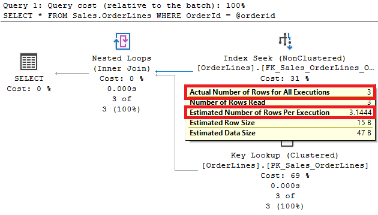

# SQL Server Statistics and Cardinality Estimator 101

- [1. Setting up the environment](#1-setting-up-the-environment)
- [2. Basics](#2-basics)
	- [1. Basic Statistics](#1-basic-statistics)
	- [2. Searching a range of values](#2-searching-a-range-of-values)
	- [3. Searching on the result of a calculation](#3-searching-on-the-result-of-a-calculation)
- [2. Filtered Statistics](#2-filtered-statistics)

I will show how SQL Server uses statistics when creating the execution plan for a given query.

I am not covering all the possible calculations SQL Server can do to estimate the number of rows to be returned by an operator, but you will get an idea of how SQL Server uses statistics for estimations.

Consider that for demo purposes, data is not being updated so you can see the behavior using recently updated statistics. In real life, data could be changing so you need to update statistics frequently to allow SQL Server to make good decisions.


## 1. Setting up the environment

You can follow the commands in this post; however, it is almost sure that you do not get the same results as it depends on the statistics for the database in a point in time.

1. Install SQL Server 2019 Developer Edition from [SQL Server Downloads](https://www.microsoft.com/es-mx/sql-server/sql-server-downloads)

1. Restore WideWorldImporters sample database available at [WideWorldImporters](https://github.com/Microsoft/sql-server-samples/releases/tag/wide-world-importers-v1.0)

---

## 2. Basics

### 1. Basic Statistics

I recommend you to read [DBCC SHOW_STATISTICS (Transact-SQL)](https://docs.microsoft.com/en-us/sql/t-sql/database-console-commands/dbcc-show-statistics-transact-sql "DBCC SHOW_STATISTICS (Transact-SQL)") to have a better insight of the statistics used by SQL Server.

1. Open a new query window

1. Change the context to database *WideWorldImporters*

1. Enable **Include Actual Execution Plan** by pression Ctrl+M

1. Query table *Sales.OrderLines* to get rows where *OrderID = 242*

	```sql
	SELECT * 
	FROM Sales.OrderLines
	WHERE OrderID = 242
	```

	Go to the *Execution Plan* tab. Place the mouse pointer on top of the arrow that starts in the **Index Seek** operator on the **FK_Sales_OrderLines_OrderID** index. Notice SQL Server estimated it would return 5 rows, and it actually returned 5 rows. SQL Server was able to exactly estimate the number of rows returned by the query. 

	

	Q: How SQL Server was able to estimate the number of rows to be returned?
	
	A: Statistics

1. Open a second query window and see the statistics for the index used in the execution plan

	```sql
	dbcc show_statistics ('Sales.OrderLines',FK_Sales_OrderLines_OrderID)
	```

	Notice that the histogram has the exact information on how rows (EQ_ROWS) exist for the OrderID 242. Therefore, SQL Server was able to estimate the exact number to be returned by the query.

	

	It is important to understand that this was pure luck, the query looks for a value that is an upper bound column value for a histogram step. If you update statistics the upper bound column value for the histogram steps could change, or you can be looking for a value that is not an upper bound column value for a histogram step.

1. Query table *Sales.OrderLines* to get rows where *OrderID = 35871*

	```sql
	SELECT * 
	FROM Sales.OrderLines
	WHERE OrderID = 35871
	```

	Go to the *Execution Plan* tab. Place the mouse pointer on top of the arrow that starts in the **Index Seek** operator on the **FK_Sales_OrderLines_OrderID** index. Notice SQL Server estimated it would return 3.14076 rows, and it actually returned 3 rows.

	

	Q: It makes no sense to think that SQL Server will return a fraction of a row. Why SQL Server estimates a non-integer number of rows?
	
	A: This is just an estimate based on statistics used by SQL Server to find a good enough execution plan.

	Check the statistics again for the index. Notice that the histogram does not have information about how many rows exist for OrderID = 35871, so it uses the AVG_RANGE_ROWS clues for the step with the information for rows OrderID > 34751 and OrderID < 51419. Therefore, SQL Server is estimating a non-integer number of rows, it is using a value that correspond to the average of rows for each distinct value within the histogram step. AVG_RANGE_ROWS is calculated by dividing RANGE_ROWS by DISTINCT_RANGE_ROWS. You can refer to Microsoft documentation for further information.

	

1. Query table *Sales.OrderLines* to get rows where *OrderID = 35871*

	```sql
	DECLARE @orderid int
	SET @orderid = 35871
	SELECT * 
	FROM Sales.OrderLines
	WHERE OrderId = @orderid
	```

	This query returns the exact same information that the one in the previous step.

	Go to the *Execution Plan* tab. Place the mouse pointer on top of the arrow that starts in the **Index Seek** operator on the **FK_Sales_OrderLines_OrderID** index. Notice SQL Server estimated it would return 3.1444 rows, and it actually returned 3 rows.

	

	Notice that the number of estimated rows changed from 3.14076 to 3.1444.

	It is a small change but if it is returning the same information. Why is SQL Server getting different estimates? May be the statistics were updated, but in this case, statistics have not changed. What happened?

	The answer is that both queries are not the same. Both return the same result, but they are not equal.

	In the query 

	```
	SELECT * 
	FROM Sales.OrderLines
	WHERE OrderID = 35871
	```

	At compilation time, SQL Server knows the value for OrderID to look for 

	In the query 

	```
	DECLARE @orderid int
	SET @orderid = 35871
	SELECT * 
	FROM Sales.OrderLines
	WHERE OrderId = @orderid
	```

	SQL Server does NOT know the value for OrderID to use in the WHERE clause at compilation time, so it needs to use another approach. In this case the **estimated number of rows** = **Number of rows in the table** * **Density for OrderID** 

	**estimated number of rows** = 231412 * 1.358788E-05 
	**estimated number of rows** = 3.1444

	Density is defined as  1 / # of distinct values for the column. 

	But, where did SQL Server get this information? From the index statistics

	

	For demo purposes, let's suppose that the estimated number of rows is not close to reality when using a variable as search value in the WHERE clause, so need SQL Server to know the actual value to search for at compilation time. You can achieve it by using the RECOMPILE option:

	```sql
	DECLARE @orderid int
	SET @orderid = 35871
	SELECT *
	FROM Sales.OrderLines
	WHERE OrderId = @orderid
	OPTION (RECOMPILE)
	```

	Go to the *Execution Plan* tab. Place the mouse pointer on top of the arrow that starts in the **Index Seek** operator on the **FK_Sales_OrderLines_OrderID** index. Notice SQL Server estimated 3.14076 rows even when using a variable.

	**IMPORTANT**: The RECOMPILE option can be useful in some scenarios, but it can increase CPU usage and the Database Engine will not cache the query plan so there is no plan reuse. As with any other hint, use it with caution.

### 2. Searching a range of values

1.  Look for rows where OrderID > 52412

	```sql
	SELECT * 
	FROM Sales.OrderLines
	WHERE OrderID > 52412
	```

	Go to the *Execution Plan* tab. Place the mouse pointer on top of the arrow that starts in the **Clustered Index Scan** operator on the **PK_Sales_OrderLines** index. Notice SQL Server estimated with total accuracy the number of rows to be returned (65963 rows)

	

	SQL Server is using the histogram to get this value.

	

1.  Look for rows where OrderID > 52412 using a variable as search value

	```sql
	DECLARE @orderid int
	SET @orderid = 52412
	SELECT * 
	FROM Sales.OrderLines
	WHERE OrderID > @orderid 
	```

	Go to the *Execution Plan* tab. Place the mouse pointer on top of the arrow that starts in the **Clustered Index Scan** operator on the **PK_Sales_OrderLines** index. Notice the estimated number of rows (69423.6) is far away from the actual number of rows returned (65963 rows)

	

	As a variable is used, SQL Server does NOT know the value for @orderid at compilation time, so it needs to use another approach. In this case, the cardinality of the filter is equal to the cardinality of its left child multiplied by the probability of the comparison being true, which is always 30 percent.

	**estimated number of rows** = 231412 * 0.30
	**estimated number of rows** = 69423.6

	**IMPORTANT**: In this case, the RECOMPILE option can be used to get a better estimate. Once again, use it with caution.

### 3. Searching on the result of a calculation

1. Look for rows where quantity*UnitPrice = 100

	```sql
	SELECT * 
	FROM Sales.OrderLines
	WHERE quantity*UnitPrice = 100
	```

	Go to the *Execution Plan* tab. Place the mouse pointer on top of the arrow that starts in the **Clustered Index Scan** operator. Notice SQL Server estimated 61.1877 rows, but it actually returned 1168. The estimation is far from the actual value, and it could cause that SQL Server chooses a plan that is not good.

	

1. Look for rows where quantity*UnitPrice > 100

	```sql
	SELECT * 
	FROM Sales.OrderLines
	WHERE quantity*UnitPrice > 100
	```

	Go to the *Execution Plan* tab. Place the mouse pointer on top of the arrow that starts in the **Clustered Index Scan** operator. Notice SQL Server estimated 69423.6 rows (30% of the table) but it actually returned 171257. The estimation is far from the actual value, and it could cause that SQL Server chooses a plan that is not good.

	

	In both cases, what can be done to help SQL Server to get a better estimate and at the same time avoid the Clustered Index Scan? There could be several valid solutions, but in this case let�s use computed columns
		
1. Create a computed column with the result of quantity*UnitPrice:

	```sql
	ALTER TABLE Sales.OrderLines 
	ADD [totalforline]  AS ([UnitPrice]*[Quantity])
	```

1. Create an index on the computed column

	```sql
	CREATE INDEX ix_OrderLines_totalforline
	ON Sales.OrderLines (totalforline)
	```

1.  Look again for rows where quantity*UnitPrice = 100

	```sql
	SELECT * 
	FROM Sales.OrderLines
	WHERE quantity*UnitPrice = 100
	```

	Go to the *Execution Plan* tab. The execution plan changed a bit, but the estimates did not improve. 

	

	The same will happen for

	```sql
	SELECT * 
	FROM Sales.OrderLines
	WHERE quantity*UnitPrice > 100
	```

	What can be done to take advantage of the computed column and the index on it? 

1. Change the query to use the computed column in the WHERE clause 

	```sql
	SELECT * 
	FROM Sales.OrderLines
	WHERE totalforline = 100
	```

	Go to the *Execution Plan* tab. Place the mouse pointer on top of the arrow that starts in the **Nested Loop** operator. Notice that the estimated number is rows is the same as the actual number of rows and an **Index Seek** operator is being used. We have a better plan now.

	

	The same will happen for

	```sql
	SELECT * 
	FROM Sales.OrderLines
	WHERE quantity*UnitPrice > 100
	```

1. Explore the statitiscs for the index *ix_OrderLines_totalforline*
	```sql
	dbcc show_statistics ('Sales.OrderLines',ix_OrderLines_totalforline)
	```

	

	The values in the RANGE_HI_KEY correspond to the result of quantity*UnitPrice

---

## 2. Filtered Statistics

Sometimes, SQL Server the expected number of rows for an operator can be quite different from the actual number of rows. This can happen even after updating statistics with a big sample, even with FULLSCAN. This situation is not caused by an issue on SQL Server, it is just the result of using the histogram, data distribution and the AVG_RANGE_ROWS values on the histogram.

As the number of rows in a table grows, if the data is not evenly distributed, the AVG_RANGE_ROWS (the average of rows for each distinct value in the step) cannot represent reality causing bad estimates. You could have values for AVG_RANGE_ROWS that represent data better if you increase the number of steps in the histogram, but you have no control on it in SQL Server. SQL Server defines the number of steps up to 200.

1. Get the minimum and maximum value for column *PickingCompletedWhen* in Sales.OrderLines 

	```sql
	SELECT MIN(PickingCompletedWhen), 
			MAX(PickingCompletedWhen) 
	FROM Sales.OrderLines 
	```

	The results are
	- MIN(PickingCompletedWhen) = 2013-01-01 11:00:00.0000000
	- MAX(PickingCompletedWhen) = 2016-05-31 11:00:00.0000000

	Look for a value within that range, '2016-05-15' in this example:

	```sql
	SELECT * 
	FROM Sales.OrderLines
	WHERE PickingCompletedWhen = '2016-05-15'
	```

	Go to the *Execution Plan* tab. Place the mouse pointer on top of the arrow that starts in the **Index Seek** operator. Notice that the query returns no rows, but the estimated number is rows is 199.75

	

1. Open a second query window and see the statistics for the index used in the execution plan

	```sql
	dbcc show_statistics ('Sales.OrderLines',[IX_Sales_OrderLines_Perf_20160301_01])
	```

	As expected, the expected number of rows is the AVG_RANGE_ROWS value for the step in the histogram that contains the value.

	


	Q: Assume that most of your queries look for rows where PickingCompletedWhen are not older than 2 months. How can you help SQL Server to get better estimates?

	A: Filtered statistics

1. Create a statistic just for the data of the 2 most recent months

	```sql
	CREATE STATISTICS filteredstatslsat2months
	ON Sales.OrderLines (PickingCompletedWhen) 
	WHERE PickingCompletedWhen >= '2016-04-01'
	WITH FULLSCAN 
	```

1. Execute the query again to get rows where *PickingCompletedWhen = '2016-05-15'*

	```sql
	SELECT * 
	FROM Sales.OrderLines
	WHERE PickingCompletedWhen = '2016-05-15'
	```

	Go to the *Execution Plan* tab. Place the mouse pointer on top of the arrow that starts in the **Index Seek** operator. Notice that the query returns no rows (as expected), but the estimated number is rows is now much closer to reality. In this case it estimated 1 instead of 199.75. A big improvement!!

	

1. Review the histogram for the new filtered statistic:

	```sql
	dbcc show_statistics ('Sales.OrderLines',[filteredstatslsat2months])
	```

	Notice that the histogram shows more accurate information about data distribution on the column *PickingCompletedWhen* of table *Sales.OrderLines*

	